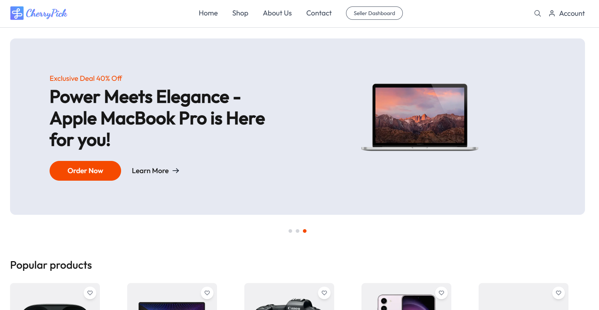

# CherryPick TechShop

CherryPick TechShop is an online reseller shop that specializes in selling high-quality gadgets. Built using **TypeScript**, **Next.js**, and **Firebase**, this platform offers a seamless and efficient shopping experience.

## 🚀 Features
- 🔥 Secure authentication with Firebase
- 📦 Efficient product listing and management
- 🛒 Shopping cart and checkout system
- 💳 Payment integration
- 📡 Real-time updates with Firebase
- 🎨 Dark/Light mode using next-themes

## 🖼️ Screenshot

## 📚 Tech Stack
- **Frontend:** Next.js, TypeScript, Tailwind CSS
- **Backend:** Firebase (Authentication, Firestore, Storage, Functions)
- **State Management:** React Context API
- **Theming:** next-themes

## 📖 Learn More
Here are some resources to help you understand the technologies used in this project:
- [Next.js Documentation](https://nextjs.org/docs)
- [Firebase Documentation](https://firebase.google.com/docs)
- [TypeScript Documentation](https://www.typescriptlang.org/docs/)

## 🤝 Contribution
Contributions are welcome! Follow these steps to contribute:
1. Fork the repository.
2. Clone your fork: `git clone https://github.com/your-username/cherrypick-techshop.git`
3. Create a new branch: `git checkout -b feature-branch`
4. Commit changes: `git commit -m 'Add new feature'`
5. Push to your fork: `git push origin feature-branch`
6. Open a pull request.

## 👥 Contributors
- **[Mushfiqbh](https://github.com/mushfiqbh)** - Founder & Developer
- _Your Name Here_ (Add yourself by contributing!)

## 📜 License
This project is licensed under the **MIT License**.

---
Made with ❤️ by CherryPick TechShop Team.

